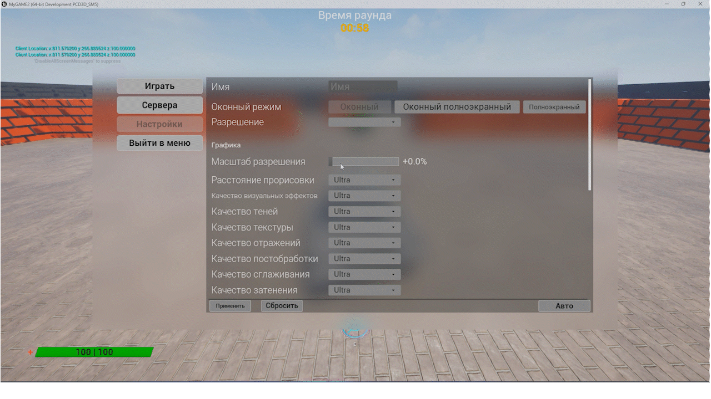

# MyGAME2 — Multiplayer Tank Shooter on Unreal Engine 5

A multiplayer arcade tank game built on **UE 5.7 / C++20**: timed rounds,
Deathmatch and Team Match modes, 4 tank classes with unique abilities,
in-game chat, statistics, and map voting. Client-server architecture with
Dedicated Server support.

<p align="center">
   
   
</p>


**Stack:** Unreal Engine 5.7 · C++20 · Blueprints · UMG · Online Subsystem
(Client / Listen Server / Dedicated Server)

---

## Table of Contents

- [Features](#features)
- [Tank Classes](#tank-classes)
- [Controls](#controls)
- [Build & Run](#build--run)
- [Multiplayer](#multiplayer)
- [Project Structure](#project-structure)
- [Architecture](#architecture)
- [Key Files](#key-files)

---

## Features

- **Two game modes** — Deathmatch (free-for-all) and Team Match (two teams
  with auto-balancing and a shared score).
- **Full round lifecycle** — waiting for players → pre-round timer and
  tank selection → timed combat → results screen → map vote → travel to
  the next map.
- **4 tank classes**, each with its own special ability (`E` key) and
  stats defined in Data Assets.
- **Spectator mode** — after death, the player switches to a spectator and
  can follow the tank that killed them.
- **In-game chat** with message replication to all clients.
- **Map voting** between rounds (maps pulled from a Data Table).
- **Stats table** (`Tab`) — kills, deaths, nicknames, team scores.
- **Menus and settings** — LAN session browser, direct IP connect,
  nickname input, mouse sensitivity, key rebinding; all saved to a save
  slot.

## Tank Classes

| Tank | Class | Special Ability |
|---|---|---|
| Light | `ALight_Tank` | Boost — temporarily increases hull speed, hull rotation, and turret rotation speed |
| Medium | `AMedium_Tank` | Ghost — disables collision, allowing it to pass through obstacles |
| Heavy | `AHeavyTank` | Double Damage — the next shot deals boosted damage |
| Stealth | `AStealth_Tank` | Invisibility — cancelled when the tank takes damage |

Stats (damage, speed, HP, reload time, ability duration and cooldown) are
configured in Data Assets under `Content/Data/DataAssets/DA_*` — subclasses
of `UBaseTankConfigDataAsset` — with no code changes required.

## Controls

| Action | Key |
|---|---|
| Move forward / backward | `W` / `S` |
| Turn hull | `A` / `D` |
| Rotate turret / look | Mouse |
| Shoot | `LMB` |
| Aim | `RMB` |
| Special ability | `E` |
| Chat | `T` |
| Stats table | `Tab` |
| Pause / menu | `Esc` |

## Build & Run

**Requirements:** Unreal Engine 5.7, Visual Studio 2022 (with the "Game
development with C++" workload, see `.vsconfig`), Windows 10/11 x64.

1. Right-click `MyGAME2.uproject` → **Generate Visual Studio project files**.
2. Open the `.sln`, select `Development Editor | Win64`, build.
3. Launch `MyGAME2.uproject`.

Three build targets: `MyGAME2Editor` (editor), `MyGAME2` (client),
`MyGAME2Server` (dedicated server).

## Multiplayer

Supported:

- **Dedicated server** — `UBaseGameInstance` automatically creates a LAN
  session on startup (up to 4 connections, join-in-progress allowed);
- **Direct connection** by IP from the main menu.

## Project Structure

```
Source/MyGAME2/
├── BaseTank.h/.cpp            # base tank: movement, turret, shooting, replication
├── bullet.h/.cpp              # projectile (ProjectileMovement), damage dealing
├── HealthStat.h/.cpp          # health and death component
├── PawnController.h/.cpp      # PlayerController: input, UI, respawn
├── Game_Spectator.h/.cpp      # spectator pawn
├── Pawns/                     # Light / Medium / Heavy / Stealth tanks
├── Data/
│   ├── DataAssets/            # tank stat configs
│   └── ST_MapInfo.h           # Data Table row with map info
├── Enums/                     # E_GameState, E_Team, E_AllPawns, E_InputMode, E_PlayerSpace
├── Game/
│   ├── Base_GameMode           # round rules, spawning, scoring, map change
│   ├── BaseGameState/TeamGameState  # timers, state, team scores
│   ├── BaseGameInstance        # sessions, saves
│   ├── BaseHUD                 # manages all widgets
│   ├── PlayerStatistic(Team)    # PlayerState: kills, deaths, nickname, team
│   ├── Components/             # ChatComponent, VoteComponent
│   └── Save/BaseSaveGame        # player settings
└── Widgets/                    # MainMenu / PreRound / InGame / EndRound / General

Content/
├── Blueprint/                  # BP subclasses of the C++ classes
├── Level/                      # MainMenu, DeathMatch, TeamMatch, transition map
├── Data/                       # Data Assets, Data Tables
├── UI/                         # UMG widgets
└── Localization/Game/{en,ru-RU}
```

## Architecture

**Round lifecycle:**

```
PreStart ──► Game ──► EndGame ──► Map Vote ──► ServerTravel to the next map
```

`ABaseGameState` ticks once per second and, depending on `E_GameState`,
runs either the pre-round countdown (`TickPreRoundTime`) or the round timer
(`TickRoundTime`). State changes are replicated via
`OnRep_RoundInProgress` and fan out on clients through the
`PreRoundStarted` / `RoundStarted` / `RoundEnded` delegates, which the HUD
and controller subscribe to — the main pattern used for UI updates
throughout the project.

**Separation of responsibilities:**

| Class | Role |
|---|---|
| `ABase_GameMode` | Server-only: spawning, scoring, damage rules, travel |
| `ABaseGameState` / `ATeamGameState` | Replicated state: timers, round status, chat, voting |
| `APlayerStatistic(Team)` | PlayerState: kills, deaths, alive status, nickname, team |
| `APawnController` | Input, input modes (game/UI), respawn, sending chat/votes to the server |
| `ABaseHUD` | Single point of creation/visibility control for all widgets |
| `UBaseGameInstance` | Persists across levels: sessions, saves |

## Key Files

- [`BaseTank.cpp`](Source/MyGAME2/BaseTank.cpp) — movement and shooting
  replication, client-server sync with desync correction.
- [`BaseGameState.cpp`](Source/MyGAME2/Game/BaseGameState.cpp) — round
  state machine and delegate-driven UI updates.
- [`HealthStat.cpp`](Source/MyGAME2/HealthStat.cpp) — health component,
  damage and death handling.
- [`BaseGameInstance.cpp`](Source/MyGAME2/Game/BaseGameInstance.cpp) —
  session creation/search/join via `OnlineSubsystem`.
